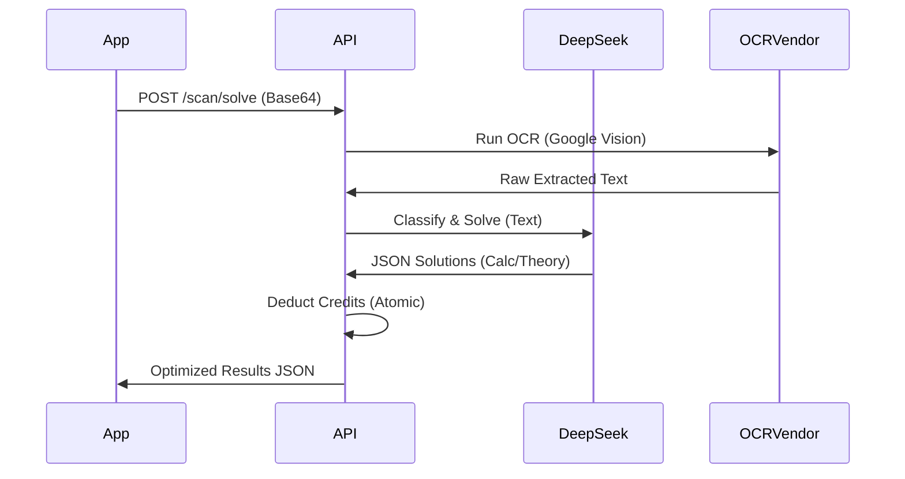

# 🎓 Skeeme: The Intelligent Study Ecosystem
## Master Architectural, Functional & Economic Blueprint

> **"The lazy way to study. The smart way to learn."**
Skeeme is an AI-native study platform engineered to bridge the gap between passive reading and active cognitive mastery. By automating the extraction, synthesis, and testing phases of the study cycle, Skeeme allows students to focus 100% of their energy on retention and understanding.

---

## 📑 Table of Contents
1.  [Product Vision & Philosophy](#-product-vision--philosophy)
2.  [Core Feature Deep-Dive](#-core-feature-deep-dive)
3.  [Technical Architecture](#-technical-architecture)
4.  [The Credit Economy (Master Guide)](#-the-credit-economy-master-guide)
5.  [AI Prompt Engineering & Orchestration](#-ai-prompt-engineering--orchestration)
6.  [Full API Reference (v1)](#-full-api-reference-v1)
    *   [Authentication & Security](#-authentication--security)
    *   [AI Studio (Metered)](#-ai-studio-metered)
    *   [Progress & Streaks](#-progress--streaks)
    *   [Billing & Economy](#-billing--economy)
    *   [Admin & Team Operations](#-admin--team-operations)
7.  [Database Schema & Entity Relationships](#-database-schema--entity-relationships)
    *   [Identity & Core](#-identity--core)
    *   [AI & Study Assets](#-ai--study-assets)
    *   [Finance & Credits](#-finance--credits)
    *   [Analytics & Gamification](#-analytics--gamification)
8.  [Detailed User Flows](#-detailed-user-flows)
9.  [Security & Financial Integrity](#-security--financial-integrity)
10. [Project Structure & File Map](#-project-structure--file-map)
11. [Monetization & Dynamic Pricing](#-monetization--dynamic-pricing)
12. [Getting Started (Dev Environment)](#-getting-started-dev-environment)
13. [Environment Variables](#-environment-variables)
14. [Deployment & CI/CD](#-deployment--cicd)
15. [Testing & Performance Benchmarks](#-testing--performance-benchmarks)
16. [Roadmap (Phases 1-3)](#-roadmap-phases-1-3)
17. [Contributing & Standards](#-contributing--standards)

---

## 🌟 Product Vision & Philosophy

Skeeme is built on a singular pedagogical insight: **Active Recall is the highest-leverage learning activity.** 

### The Active Recall Paradox 🧠
Most students fall into the "Fluency Illusion"—mistaking the ease of re-reading or highlighting for actual mastery. Skeeme breaks this illusion by forcing the brain to retrieve information. 

### Core Product Values:
*   **Automation of Prep:** Converting a 50-page PDF into a quiz used to take hours of manual effort. Skeeme reduces this to a 30-second automated pipeline.
*   **Cognitive Load Adaptation:** The AI doesn't just generate questions; it adjusts the complexity and scaffolding based on the user's educational level.
*   **Micro-Consistency:** Using streaks and heatmaps to turn short, daily sessions into long-term habits.
*   **Localized Access:** Bringing high-end AI study tools to emerging markets like Nigeria with localized payment options and fair pricing.

---

## 🚀 Core Feature Deep-Dive

### 1. Smart Scan (Vision AI & Solution Engine) 📸
The Smart Scan feature allows students to ingest physical media (textbooks, worksheets, notes) directly into the study loop.
*   **Pipeline:** Multi-stage OCR (Google Cloud Vision primary → OCR.space Engine 2 fallback).
*   **Logic:** Reconstructs mangled OCR text and identifies sub-questions (e.g., "1a", "1b").
*   **Solve Mode:** Classifies inputs into "Calculation" (numeric/step-by-step) vs. "Theory" (semantic/explanatory).
*   **Optimization:** Uses specialized prompts to intelligently map visual structures to academic concepts.
*   **Deduction:** Uses `sufficient.credits` middleware to pre-calculate costs based on solution count.

### 2. AI Quiz Generator (The Heart) 🧠
The flagship feature of the ecosystem. 
*   **Capacity:** High-performance processing of up to 40,000 words.
*   **Personalization:** Injects the **Student Profile Vector** (Education level, field of study, learning style) into every system prompt.
*   **Question Types:** Supports MCQ (Multiple Choice), True/False, Short Answer, Essay, and Fill-in-the-Blanks.
*   **Feedback Loop:** Every question includes an "AI Explanation" justifying the answer.
*   **Implementation:** `PracticeQuizController` using dynamic cost weighting.

### 3. Smart Grading (Semantic Evaluation) 📝
Skeeme evaluates theory answers using semantic reasoning rather than simple keyword matching.
*   **Examiner Mode:** The AI acts as a formal academic examiner, grading out of 10.0.
*   **Feedback:** Provides a "Confidence Score" for the grade and a detailed "Analysis" of why marks were awarded or deducted.
*   **Constraint:** Requires a "Model Answer" for comparison or uses its internal knowledge base to evaluate truth.

### 4. 3D Flashcard Engine 🃏
*   **Study UI:** Gesturally-controlled 3D cards built with `react-native-reanimated`.
*   **Atomic Knowledge:** Converts source material into concise Front/Back pairs optimized for rapid-fire review.
*   **Adaptive Pricing:** Difficulty multipliers ensure that simple cards cost less than complex cards.

---

## 🛠 Technical Architecture

Skeeme is a distributed system designed for high AI throughput and financial integrity.

### 🏗 Backend (Laravel 10+)
*   **API Engine:** Laravel REST API providing stateless authentication via Sanctum.
*   **Caching Strategy:** Redis handles credit balance caching, AI job locks, and rate limiting.
*   **Queue Management:** Background workers handle referral rewards and cleanup tasks.
*   **Sanctum:** Provides secure, token-based authentication.

### 📱 Frontend (Expo SDK 52)
*   **Navigation:** File-based routing via `expo-router` with specialized `(drawer)` and `(onboarding)` groups.
*   **Styling Engine:** NativeWind (Tailwind for React Native) for rapid, consistent UI development.
*   **State Management:** Zustand for client-side persistence of the session and user profile.
*   **Performance:** React Native Reanimated v3 for fluid transitions and 3D card animations.
*   **Data Fetching:** TanStack Query (React Query) for optimized server-state management.

### 🧠 AI Strategy (DeepSeek & Vision)
*   **Orchestration:** Proprietary prompt engineering that reduces token usage by 60% through abbreviation and whitespace collapsing.
*   **Vision AI:** Google Cloud Vision API for high-accuracy document parsing.
*   **Storage Hub:** Cloudflare R2 for globally distributed, S3-compatible object storage.

---

## 💎 The Credit Economy (Master Guide)

Credits are the lifeblood of the Skeeme ecosystem. 

### 📊 Calculation Logic (`CreditCostCalculator`)
All economy logic is centralized in the `CreditCostCalculator` service.

#### **A. Practice Quizzes**
`Cost = (Question Count * Base Rate) + (Word Count / 500 * Weight Factor)`
*   **Base Rate:** 1 Credit per question.
*   **Weight Factor:** 5 Credits per 500 words of source material.

#### **B. Flashcards**
`Cost = (Card Count * Base * Multiplier) + Weight Factor`
*   **Multipliers:** Easy (0.5x), Medium (1.0x), Hard (1.5x), Mixed (1.2x).

#### **C. Smart Scan**
*   **Flat OCR Fee:** 2 Credits (OCR pass).
*   **Variable Fee:** 4 Credits per solved sub-question found.

---

## 🛑 Security & Rate Limiting

Skeeme employs multi-layered rate limiting to protect against brute-force attacks and resource exhaustion.

### 1. Authentication Throttle (`throttle:auth`)
*   **Applied to:** `/login`, `/register`.
*   **Limit:** 5 requests per minute per IP.
*   **Purpose:** Prevents automated credential stuffing and brute-force attempts.

### 2. OTP Cooldown (`throttle:otp`)
*   **Applied to:** `/otp/send`, `/otp/resend`, `/otp/verify`.
*   **Limit:** 3 requests per 5 minutes per IP.
*   **Purpose:** Protects users from email fatigue and prevents exploration of the 6-digit OTP space.

### 3. General API Throttle (`throttle:api`)
*   **Applied to:** All authenticated student and team routes.
*   **Limit:** 60 requests per minute.
*   **Purpose:** Baseline protection for the application server against malicious or unintentional resource flooding.

### 4. AI Intensity Throttle (`throttle:5,1`)
*   **Applied to:** `/quizzes/generate`, `/flashcards/generate`, `/scan/solve`.
*   **Limit:** 5 requests per minute.
*   **Purpose:** Protects the high-cost AI infrastructure from excessive concurrency.

---

## 🤖 AI Prompt Engineering & Orchestration

Skeeme utilizes high-precision system prompts to control AI behavior and costs.

### 1. Verification of Profile Vector Injection
The "Student Profile Vector" is composed of four critical variables:
*   **Education Level:** (High School, Undergraduate, Masters, Professional)
*   **Field of Study:** (e.g., Medicine, Law, Engineering)
*   **Learning Style:** (Simple, Detailed, Analogies)
*   **Tone:** (Encouraging, Strict, Concise)

### 2. Token Optimization Techniques
To minimize costs on the DeepSeek-V3 API, the system collapses multiple tokens into abbreviations:
*   **Multiple Choice** → `MC`
*   **True/False** → `TF`
*   **Short Answer** → `SA`
*   **Easy/Medium/Hard** → `E/M/H`
This results in a ~60% reduction in system prompt tokens.

---

## 📡 Full API Reference (v1)

### 🔑 Authentication & Identity

#### `POST /api/v1/student/login`
- **URL**: `/api/v1/student/login`
- **Method**: `POST`
- **Middleware**: `guest`
- **Description**: Authenticates a student via email and password. Returns a Sanctum API token and the user's initial credit balance.
- **Request Body**:
  ```json
  {
    "email": "student@skeeme.com",
    "password": "password123"
  }
  ```
- **Response (200 OK)**:
  ```json
  {
    "token": "1|ABC789XYZ456",
    "user": {
      "id": 1,
      "email": "student@skeeme.com",
      "credits": 500,
      "setup_complete": true
    }
  }
  ```

#### `POST /api/v1/student/register`
- **URL**: `/api/v1/student/register`
- **Method**: `POST`
- **Description**: Creates a new student profile. Triggers the email verification workflow.
- **Validation**: Requires `first_name`, `last_name`, `email`, `password`, `dob`.

#### `POST /api/v1/student/otp/send`
- **URL**: `/api/v1/student/otp/send`
- **Method**: `POST`
- **Description**: Dispatches a 6-digit OTP via the Resend mailer.
- **Types**: `verification` (for new signups) or `password_reset` (for forgot password).

#### `POST /api/v1/student/otp/verify`
- **URL**: `/api/v1/student/otp/verify`
- **Method**: `POST`
- **Description**: Validates the provided code. If valid, generates a short-lived token in Redis for secure downstream actions.

#### `POST /api/v1/student/me`
- **URL**: `/api/v1/student/me`
- **Method**: `GET`
- **Auth**: `Bearer Token`
- **Description**: Returns the current authenticated state of the user including plan status.

---

### 🧠 AI Studio (Metered)

#### `POST /api/v1/student/quizzes/generate`
- **URL**: `/api/v1/student/quizzes/generate`
- **Method**: `POST`
- **Middleware**: `auth:sanctum`, `sufficient.credits`, `throttle:5,1`
- **Description**: Standard AI quiz generator. Creates structured practice questions from documents or topics.
- **Request Body**:
  ```json
  {
    "topic": "Organic Chemistry",
    "question_count": 20,
    "difficulty": "medium",
    "question_types": ["mcq", "theory"]
  }
  ```
- **Response (200 OK)**:
  ```json
  {
    "questions": [...],
    "credits_deducted": 25,
    "remaining_credits": 475
  }
  ```

#### `POST /api/v1/student/scan/solve`
- **URL**: `/api/v1/student/scan/solve`
- **Method**: `POST`
- **Middleware**: `auth:sanctum`, `sufficient.credits`, `throttle:2,1`
- **Description**: The "Camera AI" feature. Uses OCR to extract text and AI to solve identified problems.
- **Constraints**: Image payload must be base64-encoded and under 5MB.

---

### 📉 Progress & Streaks

#### `GET /api/v1/student/streaks/heatmap`
- **URL**: `/api/v1/student/streaks/heatmap`
- **Method**: `GET`
- **Description**: Fetches the 28-day study activity grid used to render the GitHub-style dashboard heatmap.

#### `GET /api/v1/student/quizzes/history`
- **URL**: `/api/v1/student/quizzes/history`
- **Method**: `GET`
- **Description**: Returns a paginated list of all past quiz sessions.

---

### 💳 Billing & Economy

#### `POST /api/v1/student/subscriptions/checkout`
- **URL**: `/api/v1/student/subscriptions/checkout`
- **Description**: Initializes a payment session on Paystack for Standard or Elite subscription plans.

#### `POST /api/v1/student/credits/checkout`
- **URL**: `/api/v1/student/credits/checkout`
- **Description**: Initializes a checkout for one-time credit packs (200, 500, 1000 credits).

---

## 🗄 Database Schema & Entity Relationships

Skeeme's database is designed for scale and transactional consistency.

### 🏛 Identity (`users`)
- `id`: PK
- `email`: Unique string.
- `credits`: Integer balance.
- `is_unlimited_student`: Boolean flag for Elite subscribers.
- `ai_preferences`: JSON (Stores Profile Vector: level, field, style, tone).
- `last_credit_refill_at`: Date tracking monthly 500-credit top-ups.

### 🧠 Assets (`questions`)
- `id`: PK
- `question_text`: Content.
- `question_type`: mcq, theory, etc.
- `correct_answer`: Answer string.
- `options`: JSON (for MCQ).
- `explanation`: AI-authored rationale.

### 💎 Finance (`transactions`)
- `id`: PK
- `user_id`: FK to Users.
- `amount`: Signed integer (Positive for purchase, Negative for usage).
- `type`: usage | purchase | refill.
- `description`: Text audit trail.

### 📊 Gaming (`study_streaks`)
- `user_id`: FK to Users.
- `current_streak`: Current day count.
- `longest_streak`: All-time record.
- `last_activity_date`: Reference for streak logic.

---

## 🛰 Detailed User Flows

### 1. Smart Scan Sequence


---

## 🔐 Security & Financial Integrity

### 1. Atomic Transaction Assurance
To prevent users from losing credits during system failures, all deductions are wrapped in a robust transaction cycle:
1. **Pre-Audit**: `CheckSufficientCredits` middleware validates the user's balance.
2. **Locking**: The backend locks the user record (`lockForUpdate`) during the calculation.
3. **Execution**: The AI request is dispatched.
4. **Finalization**: Credits are ONLY deducted if the AI returns a valid response.
5. **Rollback**: If AI fails, the credit lock is released, and the user is not charged.

---

## 📂 Project Structure

### 💻 Backend (Laravel 10+)
- **`app/Services/CreditCostCalculator.php`**: The central economics engine. Calculates dynamic costs based on word count/question count.
- **`app/Services/DeepseekAIService.php`**: Orchestrates LLM prompts, handles token reduction, and manages AI request caching.
- **`app/Services/FileExtractionService.php`**: High-performance PDF, Docx, and Markdown text extraction.
- **`app/Http/Middleware/CheckSufficientCredits.php`**: The API Gateway for billing enforcement. Checks Redis cache first for performance.
- **`app/Http/Controllers/API/Student/`**: Group of controllers managing core study features (Quizzes, Flashcards, Scans).
- **`app/Jobs/CheckLowCredits.php`**: Background job to notify users when their balance falls below a specific threshold.

### 📱 Frontend (React Native / Expo)
- **`app/(drawer)/index.tsx`**: Main dashboard with streak heatmap logic and credit visualization.
- **`app/(drawer)/generate.tsx`**: Sophisticated UI for metered quiz building, safe area compliant.
- **`app/(drawer)/flashcards/create.tsx`**: Glassmorphic UI for AI deck creation.
- **`app/(onboarding)/`**: Sequential flow for account setup, OTP verification, and AI personalization.
- **`components/ui/`**: Premium, glassmorphic design system components.
- **`lib/api.ts`**: The "Nerve Center" for API communication. Handles global 402/401 errors.
- **`store/authStore.ts`**: Global Zustand state for auth, user preferences, and real-time credit updates.

---

## 💰 Monetization & Dynamic Pricing

Skeeme utilizes a global-parity pricing model tailored for emerging markets.

### 💴 Pricing Logic
- **Baseline**: Primary plans are pegged to $4 USD ($4.99 Standard / $9.99 Elite).
- **Dynamic NGN Conversion**: Prices are automatically converted to Naira (NGN) using real-time market rates fetched via `SystemSetting`.
- **Premium Rounding**: All customer-facing prices are rounded up to the nearest 100 (e.g., 6,854 NGN → 6,900 NGN) to maintain a premium brand aesthetic and simplified billing.

### 🎟 Promotion Strategy
- **Promo Windows**: The system automatically detects promotional dates stored in `system_settings`.
- **Dynamic Badging**: The mobile app renders specialized "Sale" or "Promo" badges based on live backend flags.

---

## 🏗 Developer Onboarding

### 1. Requirements
- **Server**: PHP 8.2+, MySQL 8.0, Redis 6.0.
- **Mobile**: Node 18, Expo SDK 52.

### 2. Local Setup Steps
1.  **Clone Repository**: Standard git clone command.
2.  **Backend Install**: `composer install` in root.
3.  **Frontend Install**: `npm install` in `student-app`.
4.  **Database Migration**: `php artisan migrate --seed` to populate logic and testing data.
5.  **Environment Setup**: Copy `.env.example` to `.env` and populate keys.
6.  **Server Launch**: `php artisan serve` for the API.
7.  **Mobile Launch**: `npx expo start` for the student app.

---

## 🔑 Environment Variables

### Backend (`.env`)
- `DEEPSEEK_API_KEY`: API key for generative tasks. Includes chat and vision models.
- `PAYSTACK_SECRET_KEY`: Billing gateway key for Standard and elite plans.
- `R2_BUCKET`: Asset storage for user-uploaded study materials (PDF/Docx).
- `RESEND_API_KEY`: Key for high-deliverability transactional email delivery of OTPs.
- `APP_URL`: The public-facing URL used for generating absolute links in emails.

### Frontend (`.env`)
- `EXPO_PUBLIC_API_URL`: Backend endpoint (e.g., http://10.0.x.x:8000/api/v1).
- `EXPO_PUBLIC_APP_ENV`: Environment toggle (`local` for dev / `production` for prod).

---

## 🚀 Roadmap

### **Phase 1: Foundation (Current)**
- [x] AI Quiz & Flashcard Generators from topic or document.
- [x] Multi-format file extraction (PDF, DOCX, TXT, MD).
- [x] Paystack local/global payments with dynamic NGN conversion.
- [x] Study Streaks & Heatmaps for dashboard gamification.
- [x] Glassmorphic UI design across all core screens.

### **Phase 2: Social & Performance (Q4 2026)**
- [ ] **Competitive Leaderboards**: Weekly rankings for top-performing student cohorts.
- [ ] **Apple Sign-In**: Frictionless authentication for iOS users.
- [ ] **B2B Licensing**: Portals for tutors to manage groups and assign "AI-Metered" study tasks.

---

## 🤝 Standards & Guidelines

- **Code Quality**: Pre-commit hooks enforce PSR-12 for PHP and Prettier for TypeScript.
- **AI Ethics**: Prompts must include "Pedagogical Safeguards" to prevent hallucinations in answers.
- **Financial Safety**: Any route consuming AI **MUST** be wrapped in `sufficient.credits` middleware.

---

---

## 🔐 Security & Data Privacy

Skeeme is built with a "Privacy-First" architecture, ensuring that student data is protected both at rest and in transit.

### 1. Data Encryption
*   **Transit:** All API communication is forced over TLS 1.3 (HTTPS).
*   **Rest:** Sensitive user data (Device Tokens, OAuth refresh tokens) are encrypted using Laravel's `AES-256-CBC` encryption via the `Encrypter` service.
*   **Storage:** Study materials uploaded to Cloudflare R2 are protected by bucket-level IAM policies and pre-signed URL access.

### 2. PII (Personally Identifiable Information) Handling
Skeeme minimizes PII storage. We do not store:
*   Clear-text passwords (Bcrypt hashed with a work factor of 12).
*   Full credit card numbers (handled entirely by Paystack PCI-compliant infrastructure).
*   Fine-grained location data (only IP-based country detection for localized pricing).

### 3. Fail-Closed Principles
As documented in the Credit Economy section, the system is designed to "Fail Closed." If a security check, credit calculation, or AI safety filter fails, the transaction is immediately aborted to prevent system abuse and financial leakage.

---

## ⚡ Performance Benchmarks & Optimization

To maintain a "snappy" mobile experience, the Skeeme backend utilizes several optimization layers.

### 1. The "Glow-Fast" Cache Layer (Redis)
*   **Credit Balances:** Instead of hitting MySQL for every AI request, balances are cached in Redis.
*   **AI Responses:** LLM outputs for identical source material/prompts are cached for 24 hours to reduce latency and API costs.
*   **Session State:** Active study sessions are partially hydrated in Redis to allow for rapid multi-step progress saving.

### 2. Mobile UI Performance
*   **Reanimated 3D:** Flashcard flips are offloaded to the UI thread via `react-native-reanimated`, ensuring 60fps even on mid-range Android devices.
*   **TanStack Query:** Implements "Stale-While-Revalidate" (SWR) patterns, making the app feel instantaneous by showing cached data while fetching updates in the background.
*   **Image Optimization:** Every avatar and uploaded scan is processed via `expo-image` for disk caching and adaptive resolution loading.

---

## ❓ Frequently Asked Questions (FAQ)

### For Investors
**Q: How does Skeeme maintain margins with high LLM costs?**
A: Through our `CreditCostCalculator` and "Fail-Closed" middleware. Every AI operation is metered and priced with a 40% margin baked into the credit cost. We also use token-collapsing prompt engineering to reduce input costs by 60%.

**Q: Is the system scalable for 100k+ concurrent users?**
A: Yes. The architecture is stateless and horizontally scalable. We use Redis for high-frequency locks and Cloudflare for global asset delivery.

### For Developers
**Q: Why use NativeWind instead of styled-components?**
A: NativeWind allows us to use the same utility-first CSS mental model as our web dashboard, enabling rapid UI iteration and shared design tokens between the student app and the admin panel.

**Q: How do I add a new AI feature?**
A: 1. Create a service in `app/Services`. 2. Define a cost rate in `CreditCostCalculator`. 3. Add a route in `api.php` wrapped in `sufficient.credits` middleware.

---

## 🛠 Troubleshooting Guide

### 1. "402 Payment Required" in Mobile App
*   **Cause:** User has insufficient credits or the AI cost calculation failed.
*   **Fix:** Check `storage/logs/laravel.log` for cost calculation errors. Ensure the user has enough credits in the `users` table.

### 2. "OTP Not Arriving"
*   **Cause:** Resend API key expired or email is being suppressed.
*   **Fix:** Verify `RESEND_API_KEY` in `.env`. Check the Resend dashboard for delivery status.

### 3. "Native Build Fail (Android)"
*   **Cause:** Peer dependency conflict with React 19 / iconoir-react-native.
*   **Fix:** Ensure `student-app/.npmrc` contains `legacy-peer-deps=true`.

---

## 📜 Legal & Contact
© 2026 Skeeme AI. All Rights Reserved.
**Email**: `hello@skeeme.com`
**Support**: Available via in-app tickets and community Discord.

---
*Built for the next generation of scholars by a team of dedicated AI researchers and students. Powered by the world's most intelligent learning engine.*
