# 📚 Skeeme — Student App

Skeeme is the lazy way to study. Upload lecture slides or type a topic and Skeeme instantly turns them into quizzes, flashcards, and timed practice sessions.

---

## Why Skeeme?

Most students study by reading and highlighting. Research shows that **actively testing yourself** is far more effective. Skeeme makes that effortless by letting AI do the hard work of creating the questions, so you can focus on learning.

---

## What You Can Do

### 🧠 AI Practice Quizzes
Type a topic (e.g. *"The French Revolution"*) or upload a PDF, Word doc, or text file and get a full quiz generated instantly.

**You control:**
- Number of questions (10 to 50)
- Difficulty — Easy, Medium, or Hard
- Format — Multiple Choice, Written Answer, or Both
- Study Timer — set a countdown to simulate real exam pressure

After answering each question, you get **instant feedback** — correct answers light up green, wrong ones turn red. You can then tap "Explain Answer" to see a detailed AI explanation flip into view.

---

### 🃏 AI Flashcard Decks
Turn any topic or document into a set of flashcards you can study on the go.

- Cards flip with a smooth 3D animation
- Build as many decks as you need
- Control the number of cards and difficulty

---

### 🎨 AI Personalization
Skeeme adapts to **you**. During setup, our AI analyzes your learning goals, current academic level, and preferred study style to customize the personality and complexity of the quizzes it generates. Whether you're a high-schooler cramming for SATs or a medical student masterng complex anatomy, the AI scales its depth to match your needs.

---

### 📡 Offline Study History
Never lose your progress, even in a dead zone. All your quiz sessions and flashcard decks are stored locally on your device first.
- **Review your work offline:** Browse through past quiz results and re-read explanations without an internet connection.
- **Auto-Sync:** Once you're back online, your local progress and study streaks are seamlessly synced to the cloud.
- **Instant Access:** Fast, local-first performance for a lag-free study experience.

---

### 📈 Track Your Progress

Every quiz you complete is automatically saved, so you can:

- Review every question and see where you went wrong
- Track your score and time taken for each session
- See your **study streak** — how many days in a row you've been active
- View a **28-day heatmap** of your study activity on the dashboard

---

### 🔥 Build a Study Habit

The dashboard shows your current streak, longest streak, and activity heatmap. Consistency is the most important factor in long-term retention — Skeeme keeps you accountable.

---

## Credits & Plans

Skeeme runs on a simple credit system. Generating quizzes costs credits — shorter quizzes cost less, longer ones with more questions cost more.

| Plan | Monthly Credits | Cost |
|---|---|---|
| Free | 500 (auto-refilled every month) | Free |
| Unlimited Pro | Unlimited | $4/month |

Free students get **500 credits per month**, automatically topped up — no payment required to start.

---

## App Architecture — Mind Map

```mermaid
graph TD
    APP["🎓 Skeeme Student App"]

    APP --> AUTH["🔑 Authentication"]
    APP --> DASH["📊 Dashboard"]
    APP --> QUIZ["🧠 AI Quizzes"]
    APP --> FLASH["🃏 Flashcards"]
    APP --> HIST["📋 Quiz History"]
    APP --> ACC["👤 Account"]
    APP --> BILLING["💳 Billing"]

    AUTH --> LOGIN["Login Screen"]
    AUTH --> TOKEN["Token stored in Zustand"]

    DASH --> GREET["Time-of-day greeting"]
    DASH --> CREDITS["Credit balance + progress bar"]
    DASH --> STREAK["Daily study streak"]
    DASH --> HEATMAP["28-day activity heatmap"]
    DASH --> TOOLS["Quick access to Study Tools"]

    QUIZ --> SOURCE["Source — Topic or File Upload"]
    QUIZ --> SETTINGS["Settings — Count, Difficulty, Format, Timer"]
    QUIZ --> GENERATE["AI generates questions via API"]
    QUIZ --> INTERACT["Interactive answer checking"]
    QUIZ --> EXPLAIN["Flip-card answer explanations"]
    QUIZ --> SAVE["Session saved on completion"]

    FLASH --> FDECK["Generate deck from topic or file"]
    FLASH --> STUDY["Swipeable 3D study UI"]
    FLASH --> MANAGE["Deck list and delete"]

    HIST --> LIST["Session list with score and date"]
    HIST --> REVIEW["Full question-by-question review"]

    ACC --> PROFILE["Edit name and email"]
    ACC --> PASS["Change password"]
    ACC --> SUB["Subscription status"]
    ACC --> LOGOUT["Sign out"]

    BILLING --> INVOICES["Past invoices list"]
    BILLING --> DOWNLOAD["Download invoice PDF"]

    QUIZ --> CREDITS
    FLASH --> CREDITS
```

---

## Feature Deep-Dive

### AI Quiz Generator
The quiz generator is the heart of Skeeme. Here's how it works end to end:

1. **Choose a source** — Enter a free-text topic or pick a file from your device (PDF, DOCX, TXT, MD).
2. **Configure the quiz** — Pick question count, difficulty, format (MCQ / Theory / Both), and optionally set a timer.
3. **Generation** — The app sends your content to the Laravel backend which calls the OpenAI API to generate structured questions.
4. **Credits deducted** — Credits are calculated based on the length of your content and the number of questions. Short quizzes are cheap.
5. **Study** — Work through each question. Answers lock in on tap. Green = correct. Red = wrong.
6. **Explanations** — Every question has a "Explain Answer" button that flips open a card with the AI's full reasoning.
7. **Completion** — When all questions are answered, your score and session data are saved to history automatically.

---

### Flashcard System
1. Generate a deck by entering a topic or uploading a file.
2. The AI creates front/back card pairs and stores them in a named deck.
3. Study mode presents cards one at a time — tap to flip with a 3D animation.
4. Swipe or use arrow buttons to move between cards, with a progress indicator.

---

### Quiz History & Review
- Saved sessions include: topic, score %, correct/total, difficulty, time taken, and a full question log.
- The detail view shows every question with the user's answer highlighted vs. the correct answer.
- Theory questions show the model answer for comparison.

---

### Study Streak & Heatmap
- A streak increments once per calendar day when any study session is completed.
- The streak resets if a day is missed.
- The dashboard heatmap renders a 28-day grid where each active day is highlighted — similar to a GitHub contribution graph.

---

### Credit System
- Every new student account receives **500 free credits**.
- Credits refill to **500 automatically on the 1st of each month** for free users.
- Credit cost per quiz = `base_cost + (word_count_factor × question_count_factor)`.
- Unlimited Pro subscribers bypass the credit system entirely.

---

## Tech Stack

| Layer | Technology | Purpose |
|---|---|---|
| Framework | React Native (Expo SDK 52) | Cross-platform iOS & Android |
| Navigation | Expo Router (File-based, Drawer) | Screen routing and deep linking |
| Styling | NativeWind 4 (Tailwind for RN) | Utility-first styling with dark mode |
| State | Zustand | Global auth and user state |
| Data Fetching | TanStack Query v5 + Axios | Server state, caching, refetch |
| Animations | React Native Reanimated v3 | 3D card flips, transitions |
| Gradients | Expo Linear Gradient | Gradient buttons and cards |
| File Picker | Expo Document Picker | PDF / DOCX upload |
| Backend | Laravel REST API | Auth, quiz generation, billing |
| AI | OpenAI API (via Laravel) | Question and flashcard generation |

---

## Status

> 🚧 This app is in active development. New features are being added regularly.

**Currently live:**
- [x] AI Practice Quizzes (topic + file upload)
- [x] Interactive answer checking with AI explanations
- [x] AI Flashcard deck generation and study UI
- [x] Quiz history with full review
- [x] Study streaks and activity heatmap
- [x] Dark mode
- [x] Credit system with monthly free refill
- [x] Unlimited Pro subscription

---

*Built for students. Powered by AI.*
